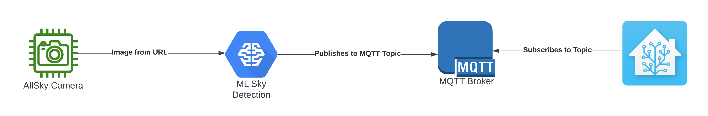
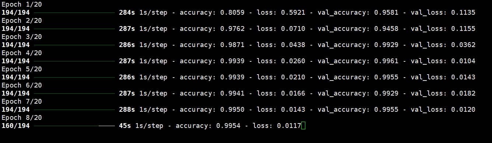
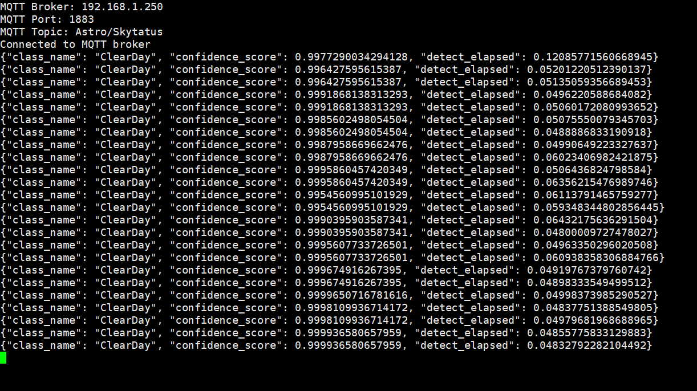
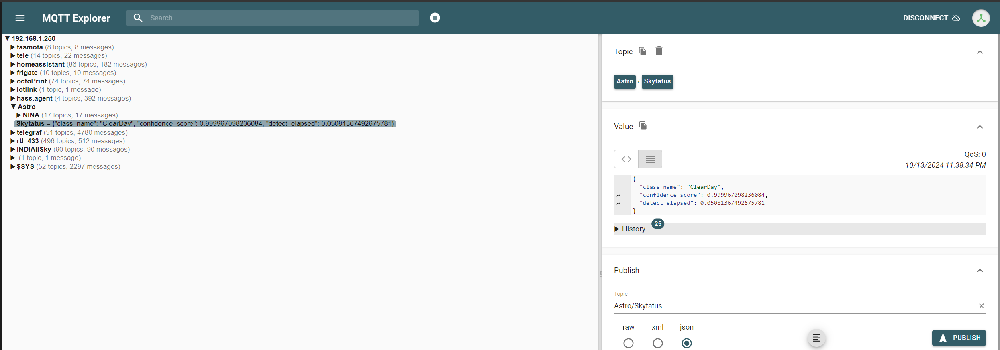
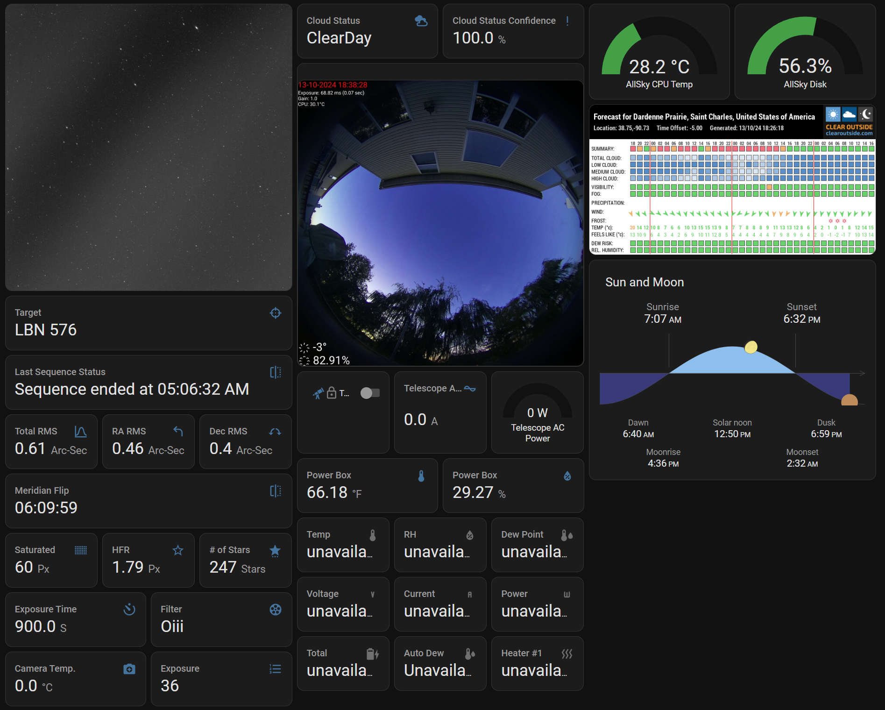

# AllSky ML Sky Detect and publish to Home Assistant via. MQTT

## Overview



This project is designed to use to determine sky conditions from TJ's AllSky application and publish it to Home Assistant via MQTT. 

This code is heavily inspired by @gordtulloch's work here:
https://github.com/gordtulloch/mlCloudDetect

I have changed it to suit my own use case.

## Changes from original code
- Remove functionality to save the results to a file as results will be published to MQTT instead
- Removed detection based on sun as this is intended to run all the time, regardless of whether it is day or night
- Removed OS checks and messages as I intend this to only run on Debian/Raspberry PI OS
- Changed the training script to accept multiple detection classes
- Changed `mlCloudDetect.py` to debug MQTT details to console for troubleshooting
- Changed requirements and imports to add and remove packages as needed
- Added the ability to obtain the image from a URL instead of from a file as I intend to run this on a different machine to the AllSky Pi
- Added the output to MQTT to include some detection parameters like confidence level, duration etc. This can be furthur used in Home Assistant to create entity colors based on confidence level of the identification
- Added progress to be shown during training on a per epoch cycle to help keep track of  training progress
- Changed `loss` to 'sparse_categorical_crossentropy'from `binary_crossentropy`
- Results are published to MQTT as a JSON object that can easily be parsed in HA using template sensors

## Overview of operations

- Clone repo
- Create venv and activate it
- Install dependencies from requirements.txt
- Train your model (my model is included but YMMV with it) and copy to the project firectory
- Configure `mlCloudDetect.ini`
- Verify the output is as expected
- Set the script to run on boot with cron
- Configure sensors in Home Assistant


## Directory Structure

- `mcpClouds.py`: Script to run the image against a model and generate the conditions output.
- `mcpConfig.py`: Configuration file handling script.
- `mlCloudDetect.ini`: Configuration file for cloud detection.
- `mlCloudDetect.py`: Main script to handle cloud detection.
- `requirements.txt`: List of dependencies required for the project.
- `trainMlMultiClass.py`: Script for training a multi-class machine learning model.

## Screenshots

Training:



Recognition:



MQTT Messages:



Home Assistant Display:




## Install

1. Clone the repository:
    ```sh
    git clone git@github.com:chvvkumar/mlCloudDetect.git
    ```
2. Navigate to the project directory:
    ```sh
    cd mlCloudDetect/
    ```
3. Create and activate a virtual environment:
    ```sh
    python3 -m venv . && source bin/activate
    ```
4. Install the dependencies:
    ```sh
    pip install -r requirements.txt
    ```
5. In some cases, you may also need to install the following 
    ```sh
    sudo apt-get update && sudo apt-get install ffmpeg libsm6 libxext6
    ```

## Usage

- To train the machine learning model:

    Place your training data in this folder structure:
    ```
    .
    └── train
        ├── ClearDay
        ├── ClearNight
        ├── CloudyandRainy
        ├── CloudyDay
        ├── CloudyNight
        └── Rainy
    ```
    and run
    ```sh
    python3 trainMlMultiClass.py
    ```
- To run the detection script:
    ```sh
    python3 mlCloudDetect.py
    ```
## Configuration

- Modify the `mlCloudDetect.ini` file to configure the cloud detection settings. Add your MQTT broker details, your training folders etc.
- Create a script called `/initMLCloudDetect.sh` at `/home/pi/initMLCloudDetect.sh` with the following contents. This script is invoked on every boot:
    ```sh
    #!/bin/bash
    cd /home/pi/mlCloudDetect/
    python3 -m venv . && source bin/activate && python3 mlCloudDetect.py
    ```
- `chmod +x` to make it executable
- Add this to your user's `crontab -e`
    ```sh
    @reboot /home/pi/initMLCloudDetect.sh
    ```

## To-Do

- Add documentation for training
- Add more classes